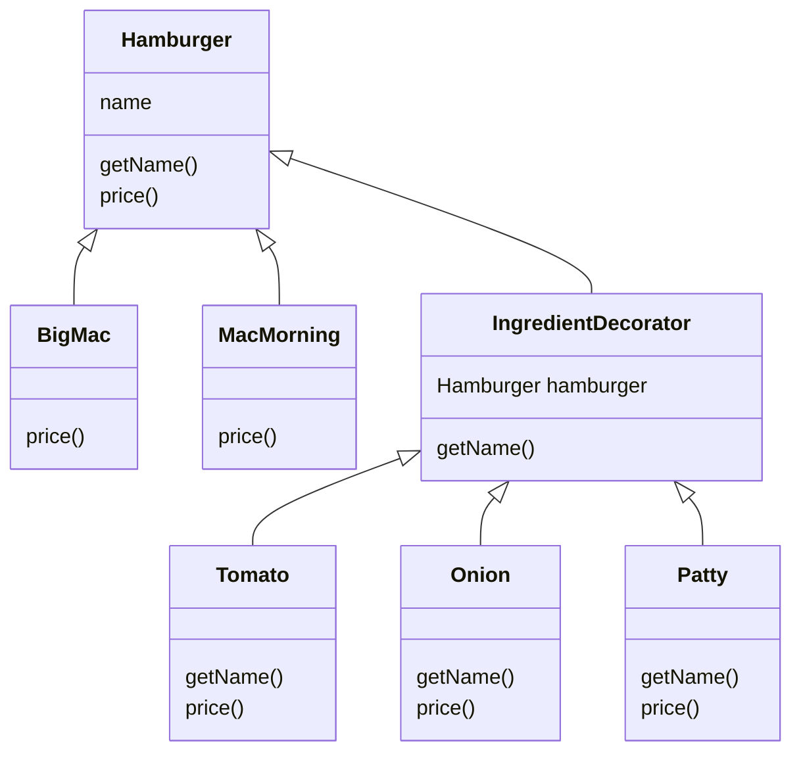

```mermaid
  classDiagram    
    class Hamburger {     
      name
      getName()
      price()  
    }
    class BigMac { 
      price()
    }
    class MacMorning { 
      price()
    }
    class IngredientDecorator { 
      Hamburger hamburger
      getName()
    }
    class Tomato { 
      getName()
      price()
    }
    class Onion {
      getName()
      price()
    }
    class Patty {
      getName()
      price()
    }
    
    Hamburger <|-- BigMac
    Hamburger <|-- MacMorning
    Hamburger <|-- IngredientDecorator  
    IngredientDecorator <|-- Tomato 
    IngredientDecorator <|-- Onion  
    IngredientDecorator <|-- Patty      
```