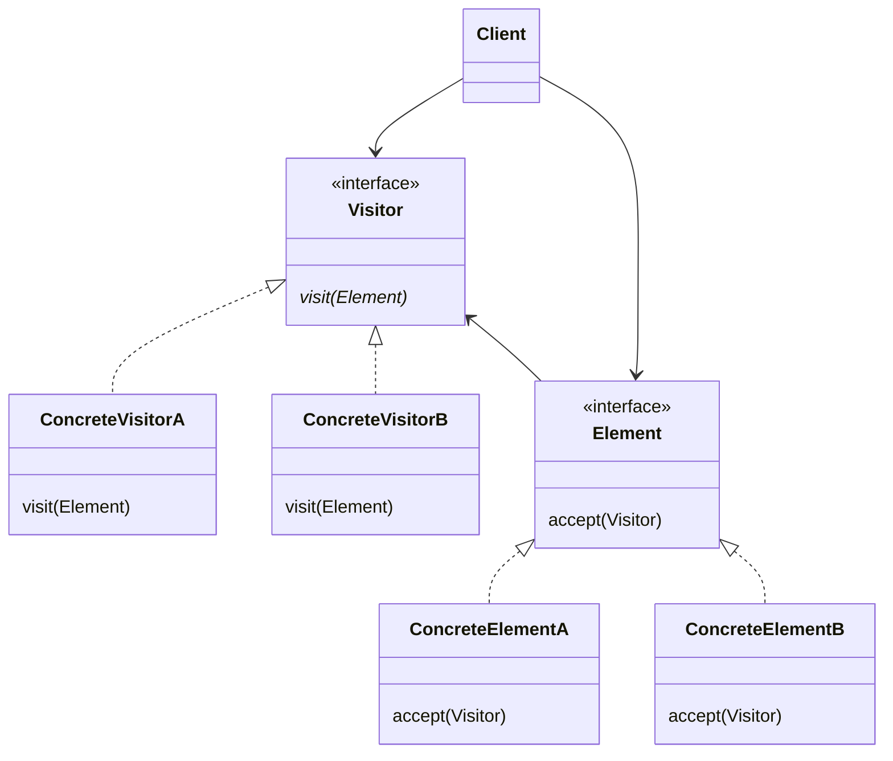

```mermaid
  classDiagram    
    class Visitor {
      visit(Element)*
    }    
    class ConcreteVisitorA {
      visit(Element)
    }
    class ConcreteVisitorB {
      visit(Element)   
    }
    class Element {
      accept(Visitor) 
    }
    class ConcreteElementA {
      accept(Visitor)
    }
    class ConcreteElementB {
      accept(Visitor)   
    }

    <<interface>> Visitor
    <<interface>> Element
    
    Client --> Visitor
    Client --> Element
    
    Visitor <|.. ConcreteVisitorA
    Visitor <|.. ConcreteVisitorB 
    Visitor <-- Element 
    Element <|.. ConcreteElementA
    Element <|.. ConcreteElementB     
```
