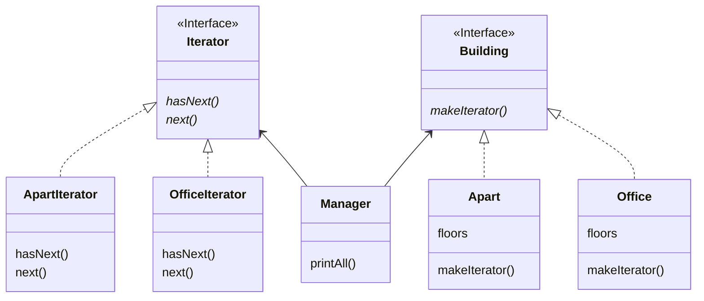
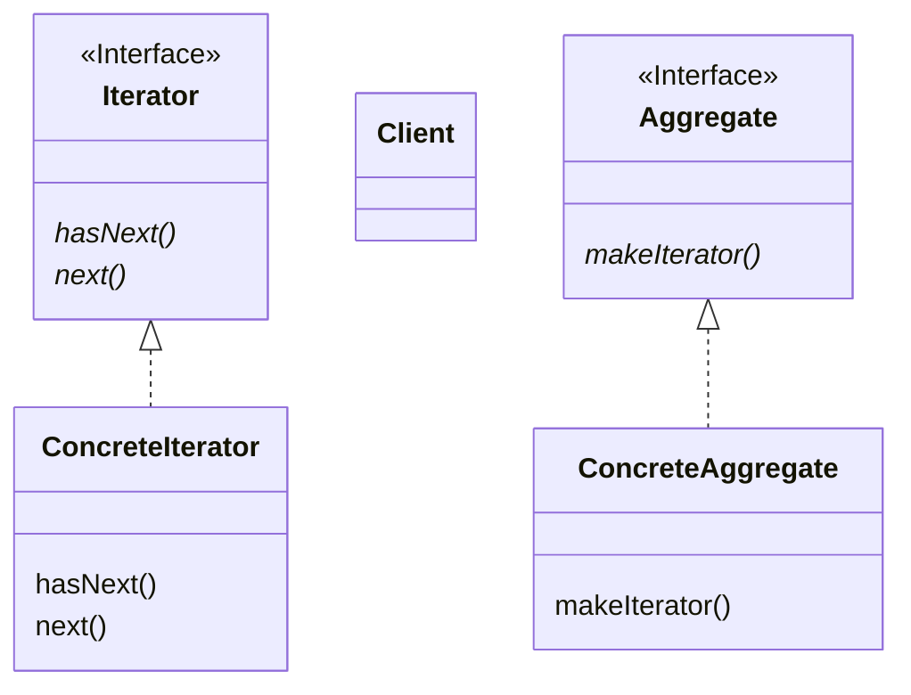

```mermaid
  classDiagram    
    class Iterator { 
      hasNext()*
      next()*
    }
    class ApartIterator { 
      hasNext()
      next()
    }
    class OfficeIterator { 
      hasNext()
      next()
    }
    class Manager {
      printAll()
    }
    class Building {
      makeIterator()*
    }
    class Apart {
      floors
      makeIterator()
    }
    class Office {
      floors
      makeIterator()
    }
    
    <<Interface>> Iterator
    <<Interface>> Building
    

    Iterator <|.. ApartIterator
    Iterator <|.. OfficeIterator    
    Iterator <-- Manager
    Building <-- Manager
    Building <|.. Apart
    Building <|.. Office    
```

```mermaid
  classDiagram    
    class Iterator { 
      hasNext()*
      next()*
    }
    class ConcreteIterator { 
      hasNext()
      next()
    }
    class Client {
    }
    class Aggregate {
      makeIterator()*
    }
    class ConcreteAggregate {
      makeIterator()
    }

    <<Interface>> Iterator
    <<Interface>> Aggregate
    
    Iterator <|.. ConcreteIterator
    Aggregate <|.. ConcreteAggregate
    
```